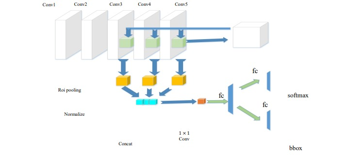
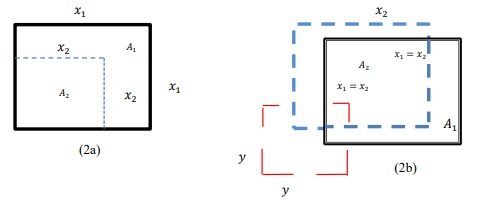
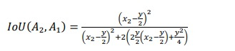
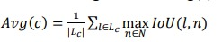

# Faster R-CNN with MobileNetV3

The architecture consists of 2 key steps: Firstly, we mathematically design the suitable sizes
of anchor boxes with 6 aspect ratios. The RPN has proposed a set of bounding boxes with a trusted rating. Secondly, we described detailed analysis of these fully convolution
architectures by using MobileNet as a feature- extractor. To every proposal, the corresponding feature
maps use the resolution in a fixed-size representation, many layers that are fully associated with
presentations are classified within specific bounding box regression. On the features of different feature
maps, the deep layers are likely to be able to provide better properties, which means that single activation
processes for input stimuli are more specific than earlier layers. We establish that, features of the
previous layers can provide performance for small objects that matches or even surpasses the performance of features from the deep layers.

## 1. Regional Proposal Network

The main point of the RPN is to propose a set of bounding boxes with a trusted rating associated with
potential logo. We modified the RPN to detect a logo with this configuration 𝐵𝑎 = 9 anchors. Since each
anchor box acts as a detector for sliding windows in a grouped image area, there are:

𝐵𝑝 = 𝐵𝑎 ×
𝑤
𝑓𝑠
×
𝐻
𝑓𝑠
(1)

Where 𝑓𝑠 corresponds to an anchor. The RPN structure conv1, conv2… , conv5. The general
observation has been confirmed in part by the fact that increasing the efficiency of highway
classification on the ImageNet. This applies to at least two common phase detection devices, such as
Faster-RCNN and MobileNet. We used a network of regional presentations (RPN), consisting of two
layers to locate the regions that can contain objects in feature maps (image). The network uses the RoI
pool layer to reduce and resize resource maps based on proposals from that region. The maps use the
new features of each region to select frame into three fully connected layers. In this work, MobileNet
which took the layers as learning functions was used as a convolutional network the original feature
extraction contains several layers and the first convolution stack structures acquired through transfer
learning by using MobileNet.

## 2. Faster RCNN_Mobilenet

Our approach has two steps forming the current object detection such as: The first one consists on
identifying ROI from images. These ROI can be considered as references in recommending some
possible object location that are more carefully developed in the second step. As shown in figure 1 with
5 convolutional layers and 3 fully connected (FC) layers. While Faster R-CNN only uses the features the last convolutional layer to localize and classify. In the first two convolution layers, after each
successive layer and one Max-pooling layer, respectively. In the next three levels, just after each
convolution layer, there is only one level of ReLU. In particular, on three levels, 3, 4 and 5, their outputs
are also used as input data for the three levels of pooling of the ROI and the corresponding normalization
levels. For each RPN anchor constituting a fully convolutional network, a degree is predicted which
makes it possible to measure the probability of this anchor which contains the element of interest. In
addition, the RPN provides the acceleration and measurement coefficients for each anchor that is part
of the peripheral regression mechanism, thereby improving the position of the object.

Figure 1. Our proposed Approach with 5 convolutional layers and 3 fully connected (FC) layers.
To properly illustrate this problem, considering the situation in figure 2a: we supposed that a second-order ground truth bounding box A2 is delimited by a side length 𝑥2 and a square anchor box A1 of side
length 𝑥1.

$$ t \le IoU (A_2,A_1) = \frac{|A_2 ∩ A_1|}{|A_2 \cup A_1|} = \frac{x_1^2}{x_1^2}$$

In general, an anchor is considered a positive example if it contains an IoU greater than 0.5 for a
ground truth objects.

Figure 2. (2a) 𝐼𝑜𝑈 can be expressed as the ratio of the areas of the limit box in the case of limits of the
same proportion. (2b) shows two bounding boxes of the same size when the anchors are selected in
stride 𝑦

To classify the anchor box as a positive example, ask the 𝐼𝑜𝑈 to exceed a certain threshold 𝑡. It
follows that for > $\sqrt{𝑡}^{−1}$
, the anchor cannot cover the field of truth sufficiently enough to be classified
as a positive example. The same thing applies to non-quadrature anchors, provided that the ratio of
groundtruth boxes and anchor boxes correspond to each other. For the above considerations, we suppose that there is an attachment point where the corner of an anchor is perfectly aligned with the ground truth
example. In practice, this is not the case, because the network performance map based on RPN is usually
much smaller than the original image. The reduction factor 𝑦 − 1 between the source image and the
object map effectively creates a network of anchors with stride 𝑦. To examine the effect of the
characteristic resolution of the card on the potential RPN to determine the state of small objects,
considering the situation in figure 2b, we suppose the case of quadratic atoms of phase 𝐴2 and the
existence of an anchor box 𝐴1 of scale and the corresponding form factor. In the worst case, each box is
moved a distance of $\frac{y}{2}$. The 𝐼𝑜𝑈 between these boxes can be represented by:

The initiative learning rate is 3e-3 and the stride size is set to, 𝑥 = 16. Assuming that t = 0.5, this
gives the minimum size of the detectable object. This indicates that for a small fraction of our size
distribution, we need an object map at a higher resolution.
Second one consists of a depthwise decomposable approach to integrate the local context from each
selected scale of the feature maps and then add it again. To factorize the convolution, a depthwise
convolution a removable winding is used, as this can help to significantly reduce calculations and
parameters. In CNN, convolution filters extract objects from input property maps through a sliding
window. Different size of pixels will be extracted by the other size of filters, so that they can be utilized
as context extractor’s tools. By using these tools, we propose an end-to-end convolution approach with
these context extractors that can be subdivided to give context to a local context. With a separable
convolution depthwise, the computation is reduced by a factor of 8-9 times and our detection speed rate
can be increased effectively. We define the convolution depth ratio in percentage M =
(only 0.25, 0.50, 0.75, 1) and adjust t = 0.5. If Object is in a group of C classes, L is the group of basic
objects Lc
( c ∈ C∈Cand N and there is a set of sentences of objects, then we can estimate the
performance of this class's RPN, that its average value is Avg(c) expressed by:

